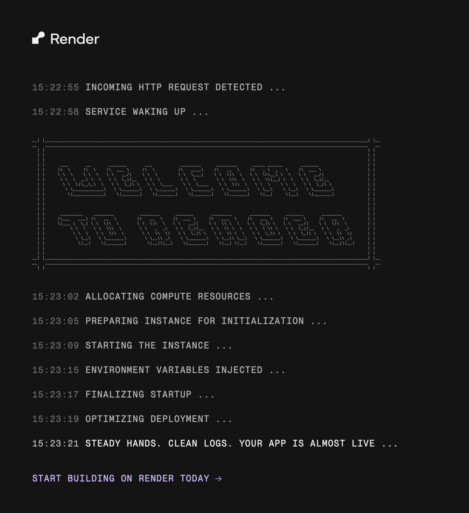
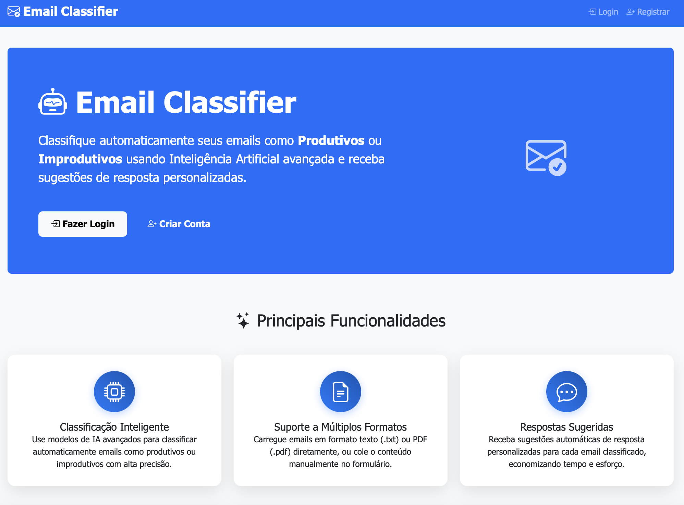
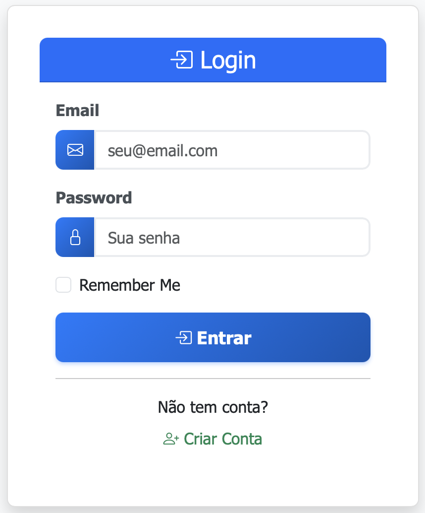
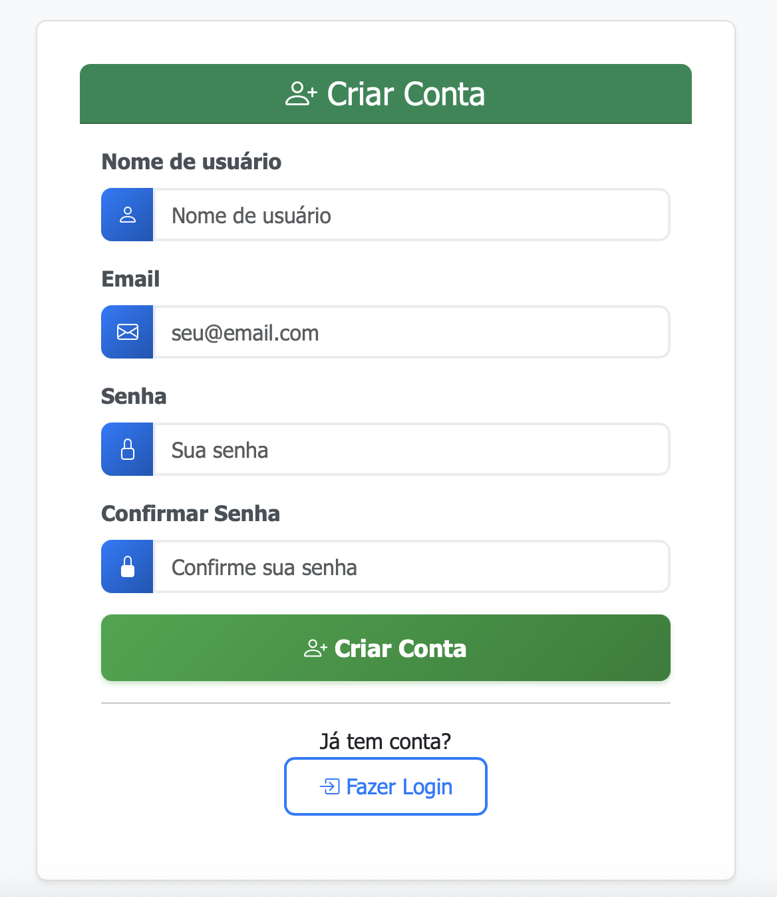
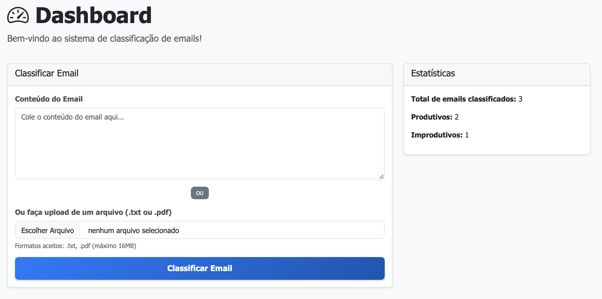
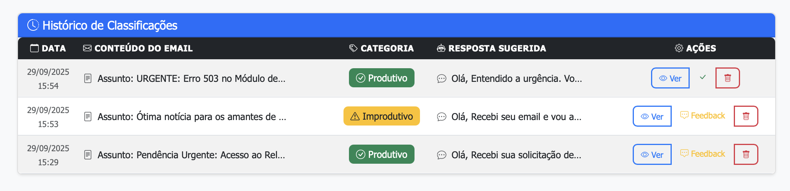
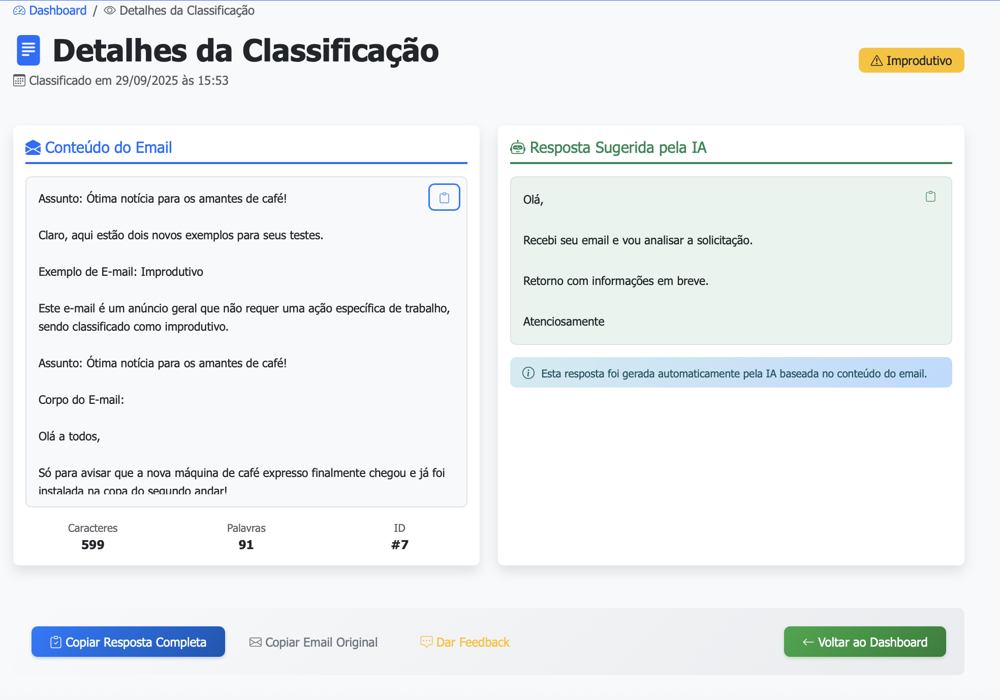

# 📧 Manual do Usuário - Email Classifier

## Bem-vindo ao Email Classifier!

O Email Classifier é uma ferramenta inteligente que utiliza Inteligência Artificial para classificar automaticamente seus emails como **Produtivos** ou **Improdutivos**, além de gerar sugestões de resposta personalizadas.

---

## 🕐 1. Tempo de Carregamento

### ⏳ Aguarde o Carregamento Inicial

Quando você acessar o sistema pela primeira vez, pode ser necessário aguardar alguns segundos para que o servidor do Render seja iniciado. Isso é completamente normal!

**📝 Importante:**
- O primeiro acesso pode demorar de 30 segundos a 2 minutos
- Seja paciente! O sistema está sendo inicializado
- Após o primeiro carregamento, a navegação será rápida
- Se a página não carregar, aguarde um pouco e recarregue (F5)

---

## 👤 2. Acesso ao Sistema

### 🔑 Login e Registro

Para utilizar o Email Classifier, você precisa ter uma conta. No canto superior direito da página principal, você encontrará os links de acesso:

**Opções disponíveis:**
- **"Fazer Login"** - Se você já possui uma conta
- **"Criar Conta"** - Para novos usuários

---

## 🚪 3. Tela de Login

### 📋 Como fazer Login

Se você já possui uma conta, clique em **"Fazer Login"** e preencha os dados:

**Passos para o Login:**
1. **Email**: Digite seu email cadastrado
2. **Senha**: Digite sua senha
3. **Lembrar de mim**: Marque para permanecer logado (opcional)
4. Clique em **"Entrar"**

**❌ Problemas de Login?**
- Verifique se o email está correto
- Confirme se a senha está correta
- Se esqueceu a senha, crie uma nova conta

---

## 📝 4. Registro de Nova Conta

### ➕ Como se Registrar

Para novos usuários, clique em **"Criar Conta"** e preencha as informações:

**Passos para o Registro:**
1. **Nome de Usuário**: Escolha um nome único
2. **Email**: Digite um email válido
3. **Senha**: Crie uma senha segura
4. **Confirmar Senha**: Digite a senha novamente
5. Clique em **"Criar Conta"**

**✅ Dicas para o Registro:**
- Use um email válido (você pode precisar dele futuramente)
- Escolha uma senha forte (mínimo 6 caracteres)
- O nome de usuário deve ser único no sistema
- Após o registro, você será redirecionado automaticamente

---

## 📨 5. Classificação de Emails

### 📎 Como Enviar Emails para Classificação

Após fazer login, você será direcionado ao dashboard principal onde pode classificar seus emails:

**Métodos de Envio:**

### **Método 1: Colar Texto**
1. Copie o conteúdo do email
2. Cole na caixa de texto **"Conteúdo do Email"**
3. Clique em **"Classificar Email"**

### **Método 2: Upload de Arquivo**
1. Clique em **"Escolher arquivo"**
2. Selecione um arquivo **.txt** ou **.pdf**
3. O conteúdo será extraído automaticamente
4. Clique em **"Classificar Email"**

**📋 Formatos Aceitos:**
- ✅ Texto simples (.txt)
- ✅ Documentos PDF (.pdf)
- ✅ Colar diretamente na caixa de texto

---

## 📊 6. Lista de Emails Classificados

### 🗂️ Gerenciando suas Classificações

Após classificar emails, você verá uma tabela com todo o histórico:

**Funcionalidades Disponíveis:**

### **📋 Informações da Tabela:**
- **Data/Hora**: Quando o email foi classificado
- **Categoria**: Produtivo ou Improdutivo
- **Prévia**: Primeiras palavras do email
- **Ações**: Botões para interagir

### **🔍 Ações Disponíveis:**

1. **👁️ Ver Detalhes**
   - Clique no ícone do olho
   - Visualiza o email completo e a resposta sugerida

2. **🗑️ Excluir**
   - Clique no ícone da lixeira
   - Confirme a exclusão no modal
   - ⚠️ **Atenção**: Esta ação não pode ser desfeita!

3. **📝 Feedback**
   - Use os botões de feedback para melhorar o sistema
   - Indique se a classificação estava correta

**🔄 Navegação:**
- A tabela é responsiva (funciona em celulares)
- Os emails mais recentes aparecem primeiro
- Use os botões de ação para gerenciar cada email

---

## 💬 7. Página de Resposta Detalhada

### 📄 Visualização Completa

Ao clicar em **"Ver Detalhes"** em qualquer email, você acessará a página completa:

**Informações Detalhadas:**

### **📧 Seção do Email:**
- **Conteúdo Completo**: Todo o texto do email
- **Data de Classificação**: Quando foi processado
- **Categoria**: Produtivo ou Improdutivo

### **🤖 Seção da IA:**
- **Resposta Sugerida**: Sugestão automática de resposta
- **Análise**: Explicação da classificação

### **📝 Seção de Feedback:**
- **Avaliação**: A classificação estava correta?
- **Comentários**: Suas observações sobre o resultado
- **Categoria Correta**: Se discordar, indique a categoria correta

**✅ Como Dar Feedback:**
1. Avalie se a classificação estava correta
2. Adicione comentários se necessário
3. Se discordar, selecione a categoria correta
4. Clique em **"Enviar Feedback"**

**🎯 Por que dar Feedback?**
- Ajuda a melhorar o sistema de IA
- Torna as futuras classificações mais precisas
- Contribui para o aprendizado do algoritmo

---

## 🆘 Dicas e Solução de Problemas

### ⚡ Dicas para Melhor Uso:

1. **Emails mais Longos**: Tendem a ter classificações mais precisas
2. **Linguagem Clara**: Emails bem escritos são classificados melhor
3. **Contexto Profissional**: Emails de trabalho são mais fáceis de identificar

### 🔧 Problemas Comuns:

**❓ "O site não carrega"**
- Aguarde 1-2 minutos (servidor iniciando)
- Recarregue a página (F5)
- Verifique sua conexão com internet

**❓ "Não consigo fazer login"**
- Verifique email e senha
- Tente criar uma nova conta
- Limpe o cache do navegador

**❓ "Arquivo não é aceito"**
- Use apenas .txt ou .pdf
- Verifique se o arquivo não está corrompido
- Tente colar o texto manualmente

**❓ "Classificação incorreta"**
- Use o sistema de feedback
- Quanto mais feedback, melhor o sistema fica
- Considere o contexto do email

---

## 🎯 Resumo Rápido

1. **Acesse** o site e aguarde carregar
2. **Faça login** ou **registre-se** (links no canto superior direito)
3. **Cole um email** ou **envie um arquivo** no formulário
4. **Visualize** suas classificações na tabela
5. **Use as ações** para ver detalhes, excluir ou dar feedback
6. **Contribua** com feedback para melhorar o sistema

---

## 📞 Suporte

Se precisar de ajuda adicional ou encontrar algum problema, você pode:
- Verificar este manual novamente
- Tentar recarregar a página
- Aguardar um pouco se o servidor estiver lento

**🎉 Aproveite o Email Classifier e tenha uma experiência mais produtiva com seus emails!**